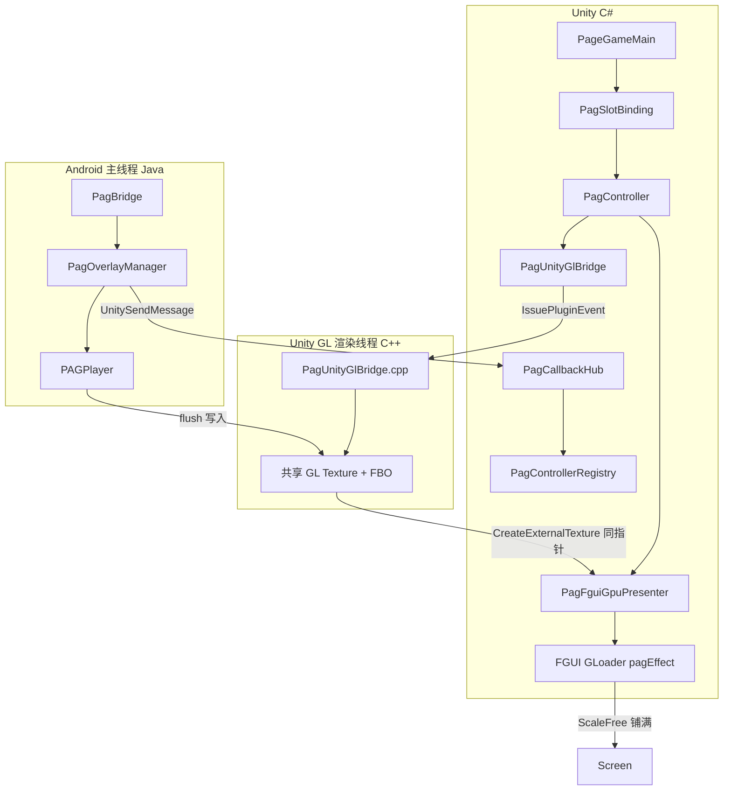
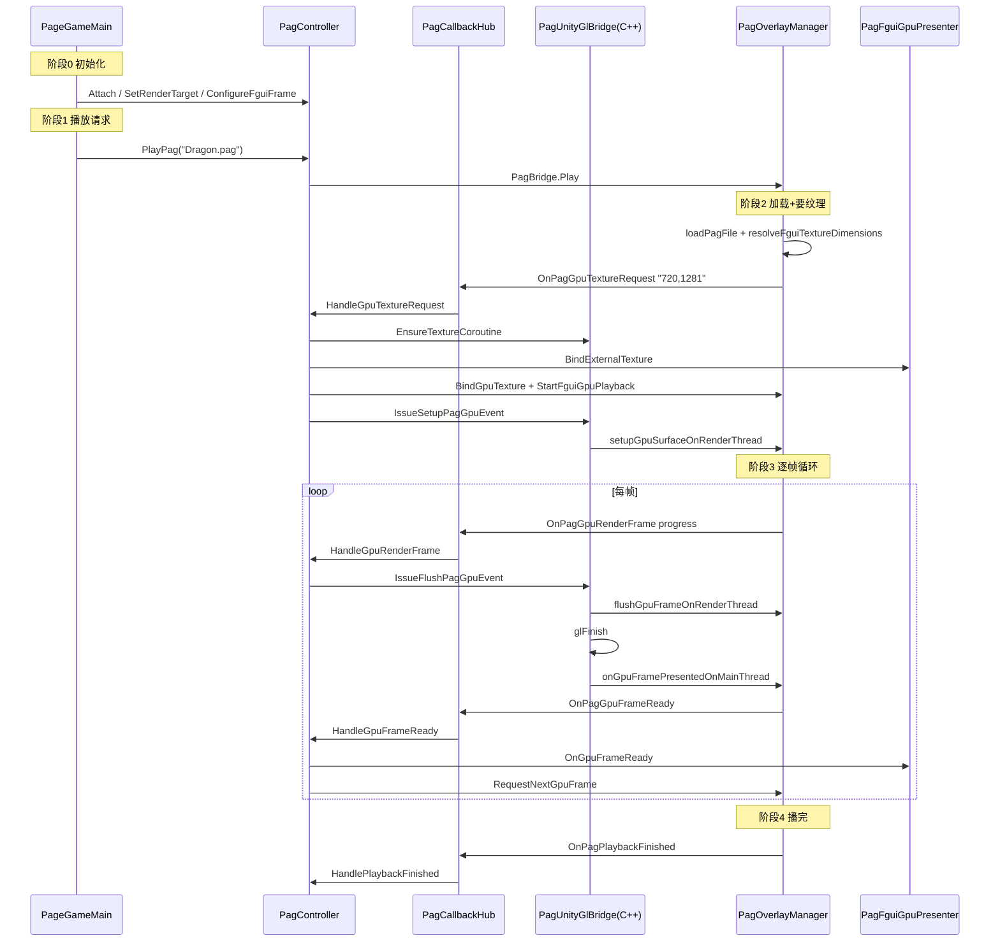

# PAG 播放流程阅读指南

> 面向第一次接触本工程 PAG 集成的开发者。  
> 关联文档：[`PAG_MAINTENANCE_PRIORITY.md`](PAG_MAINTENANCE_PRIORITY.md)（维护清单）、[`RETEST_PAG_UFO.md`](RETEST_PAG_UFO.md)（真机验收）

---

## 1. 一句话理解

**Java 管时间和 progress，Unity 渲染线程管 GL 纹理和 flush 时机，FGUI 只负责显示那块共享纹理。**

- **libpag（Java）**：加载 `.pag`、计算播放进度 `progress`、在渲染线程调用 `PAGPlayer.flush()` 把画面写入纹理
- **Unity GL（C++）**：在渲染线程创建 RGBA 纹理 + FBO，调度 `flush`，`glFinish` 后通知主线程
- **FGUI（C#）**：通过 `CreateExternalTexture` 与 libpag **共享同一块 GL 纹理**，显示在 `pagEffect` GLoader 上

不走 CPU 读像素，不走 `LoadRawTextureData`。

---

## 2. 架构总览



### FGUI 显示层级（转盘 `anchorTurnTable`）

```
anchorTurnTable
  ├── pagEffect (GLoader)  ← FGUI 预置；层级由兄弟顺序决定
  └── holder (Graph)       ← Spine 挂载点
```

---

## 3. 建议阅读顺序

| 阶段 | 文件 | 关注点 |
|------|------|--------|
| **入门** | 本文档 | 建立全貌 |
| **维护** | `PAG_MAINTENANCE_PRIORITY.md` | 已落地配置、P0 冻结项 |
| **业务示例（简）** | `Assets/HotFix/Games/Slot Zhu Zai Jin Bi 1700/PageTest.cs` | 3 锚点播 Dragon/UFO，逻辑干净 |
| **业务示例（正式）** | `Assets/HotFix/Games/Slot Zhu Zai Jin Bi 1700/PageGameMain.cs` | 转盘循环播 XingYunZhiLun / neza |
| **绑定封装** | `Assets/HotFix/Games/_Common/Anim UI/PagSlotBinding.cs` | 业务层薄封装 |
| **资源路径** | `Assets/HotFix/Games/_Common/Anim UI/PagPathHelper.cs` | AB → PagCache 解压 |
| **核心控制器** | `Assets/HotFix/Games/_Common/Anim UI/PagController.cs` | PlayPag、GPU 协程、回调处理 |
| **回调路由** | `Assets/HotFix/Games/_Common/Anim UI/PagCallbackHub.cs` | UnitySendMessage 入口 |
| **FGUI 显示** | `Assets/HotFix/Games/_Common/Anim UI/PagFguiGpuPresenter.cs` | ExternalTexture 绑定 |
| **GL 桥** | `Assets/HotFix/Games/_Common/Anim UI/PagUnityGlBridge.cs` | IssuePluginEvent |
| **JNI 入口** | `Assets/Plugins/Android/.../PagBridge.java` | Init / Play / BindGpuTexture |
| **播放核心** | `Assets/Plugins/Android/.../PagOverlayManager.java` | loadPag、flush、帧调度 |
| **C++ 渲染** | `Assets/Plugins/Android/.../PagUnityGlBridge.cpp` | 渲染线程 flush + glFinish |
| **编辑器导入** | `Assets/Editor/Pag/PagBinaryImporter.cs` | `.pag` → PagBinaryAsset 打进 AB |

---

## 4. 四个运行阶段

| 阶段 | 做什么 | 发生几次 |
|------|--------|----------|
| **0 初始化** | 创建 PagSlotBinding、Attach(fguiAnchor)、TryGetPagEffectLoader | 进局一次 |
| **1 播放请求** | ResolvePagPath → PlayPag → JNI Play → loadPagFile | 每次 PlayPag |
| **2 纹理初始化** | requestGpuTextureBind → 创建 GL 纹理 → BindExternalTexture → SetupFromTexture | 每个 clip 一次（同尺寸可复用纹理） |
| **3 逐帧循环** | requestGpuRenderFrame → flush → OnGpuFrameReady → RequestNextGpuFrame | 每帧，直到 progress ≥ 0.999 |
| **4 播完** | notifyPlaybackFinished → WaitForPlaybackFinished → 可选切下一段 clip | 每段结束一次 |

---

## 5. 完整调用链（以 Dragon.pag 为例）

> `PageGameMain` 正式环境播 `XingYunZhiLun_1080.pag` / `neza.pag`，链路与 `Dragon.pag` 完全相同。  
> `Dragon.pag` 在 `PageTest.cs` 里更容易单步跟读。

### 时序总图



---

### 阶段 0：进局前初始化

**线程：Unity 主线程**

#### 0.1 创建绑定

`InitParam` → `EnsureTurnTablePagSlot()`：

```
PageGameMain.EnsureTurnTablePagSlot()
  → new PagSlotBinding("TurnTableNpc")
  → PagSlotBinding.Attach(GetTurnTableAnchor())
    → new PagController("TurnTableNpc")
    → PagController.Attach(fguiAnchor)
      → PagCallbackHub.EnsureInstance()
      → PagControllerRegistry.Register(InstanceKey)
      → TryGetPagEffectLoader(anchor) + BindFguiLoader
```

**文件**：`PageGameMain.cs`、`PagSlotBinding.cs`、`PagController.cs`

> `CLonegoNpc` 仅用于 Spine wrapper，不再参与 PAG Attach。

#### 0.2 播放前准备 FGUI 模式

```
PageGameMain.PlayTurnTablePag()
  → PagSlotBinding.PreparePlay(useFguiTexture, maxSide, fps)
    → SetRenderTarget(FguiTexture) + ConfigureFguiFrame
    → PrepareFguiLayoutBeforePlay
  → PlayPag(...)
```

FGUI 包内须预置 `pagEffect` GLoader（`TryGetPagEffectLoader`）：

```
PagFguiGpuPresenter.TryGetPagEffectLoader(anchor)
  → 查找 anchor 下名为 pagEffect 的 GLoader
```

**文件**：`PageGameMain.cs`、`PagFguiGpuPresenter.cs`

#### 0.3 预热缓存（进局协程）

```
PlayTurnTableEnterSequence()
  → PagPathHelper.WarmupPagCacheCoroutine(fileName)
    → 从 AB 解压 .pag 到 persistentDataPath/PagCache/
```

**文件**：`PageGameMain.cs`、`PagPathHelper.cs`

---

### 阶段 1：业务触发播放

**线程：Unity 主线程**

```
PageGameMain.PlayTurnTablePag("Dragon.pag")
  ├── EnsureTurnTablePag()
  ├── TurnTablePag.ResolvePagPath("Dragon.pag")     // PagPathHelper 查/解压缓存
  ├── TryBuildTurnTablePagLayoutExtra()             // 算 FGUI 屏幕矩形 extra
  ├── SetRenderTarget(FguiTexture)
  ├── ConfigureFguiFrame(maxSide=0, fps=60)
  ├── SetRepeatCount(repeatCount)
  └── TurnTablePag.PlayPag("Dragon.pag", "center", layoutExtra)
```

**文件**：`PageGameMain.cs` 约 537–597 行

#### PlayPag 内部（C# → JNI）

```
PagController.PlayPag()
  ├── PrepareBetweenPlaybackCycles()    // 清上一轮 GPU 协程
  ├── ResetPlayStartedSignal()
  ├── ResolvePagPath()                  // 本地绝对路径
  ├── PagPathHelper.IsValidPagFile()    // 校验文件体积
  ├── EnsureInit()                      // PagBridge.Init(activity)
  ├── SetupGpuCallbacksBeforePlay()     // 注册 4 个 UnitySendMessage 回调
  └── _pagBridge.CallStatic("Play", pagPath, positionType, extra,
                            InstanceKey, "PagCallbackHub", "OnPagOverlayPlayStarted")
```

**注册的回调**：

| Unity 方法 | Java 触发时机 |
|-----------|--------------|
| `OnPagGpuTextureRequest` | 算好纹理尺寸，向 Unity 要 GL 纹理 |
| `OnPagGpuRenderFrame` | 需要 Unity 在渲染线程 flush 某一帧 |
| `OnPagGpuFrameReady` | flush + glFinish 完成，FGUI 可刷新 |
| `OnPagPlaybackFinished` | 整段播完（progress ≥ 0.999） |

**文件**：`PagController.cs` 约 474–721 行

#### Java 异步加载

```
PagBridge.Play()                          // runOnUi
  → PagOverlayManager.play()
      ├── mainHandler: prepareForNewPlay()
      └── exportHandler: loadPagFile(path)   // Worker 线程读盘
          → mainHandler: finishPlayAfterLoad()
              ├── pagFile = loaded
              └── renderMode == FGUI_GPU → requestGpuTextureBind()
```

**文件**：`PagBridge.java`、`PagOverlayManager.java` 约 333–396 行

**logcat**：`play: loading on worker` → `play: loaded ok, size=720x1281`

---

### 阶段 2：初始化 GPU 纹理（每个 clip 一次）

**线程：Android UI → Unity 主线程 → Unity 渲染线程 → Android UI**

#### 2.1 Java 算纹理尺寸，回调 Unity

```
PagOverlayManager.requestGpuTextureBind()
  → resolveFguiTextureDimensions()
      ├── w = pagFile.width()    // Dragon 约 720
      ├── h = pagFile.height()   // Dragon 约 1281
      └── maxSide=0 时不缩放，渲染尺寸 = 合成原尺寸
  → sendToUnityHub(OnPagGpuTextureRequest, "720,1281")
```

**文件**：`PagOverlayManager.java` 约 977–1033 行

#### 2.2 Hub 路由

```
PagCallbackHub.OnPagGpuTextureRequest(message)
  // message 格式: "TurnTableNpc\x1f720,1281"
  → PagControllerRegistry.Resolve("TurnTableNpc")
  → PagController.HandleGpuTextureRequest("720,1281")
  → RunCoroutine(BindGpuTextureAndStartPlayback)
```

**文件**：`PagCallbackHub.cs` 约 92–96 行

#### 2.3 Unity 创建 GL 纹理 + 绑 FGUI

```
PagController.BindGpuTextureAndStartPlayback()  [协程]
  ① PagUnityGlBridge.EnsureTextureCoroutine(slotId, texW, texH)
       → PagGl_EnqueueCreateTexture
       → GL.IssuePluginEvent(CreateTexture)     // 渲染线程建 GL Texture + FBO
  ② _fguiPresenter.BindExternalTexture(texPtr, texW, texH)
       → Texture2D.CreateExternalTexture + GLoader.texture = NTexture
  ③ _fguiPresenter.SetVisible(true)
  ④ _pagBridge.CallStatic("BindGpuTexture", InstanceKey, texId, texW, texH)
  ⑤ _pagBridge.CallStatic("StartFguiGpuPlayback", InstanceKey)
       → Java: new PAGPlayer(); setComposition(pagFile)
  ⑥ PagUnityGlBridge.IssueSetupPagGpuEvent(slotId, InstanceKey)
       → 渲染线程: PAGSurface.FromTexture(texId) + setSurface
  ⑦ scheduleFguiGpuTick() → 触发首帧 requestGpuRenderFrame
```

**同尺寸复用**：若 `_boundGpuTexW/H` 与请求尺寸一致，跳过步骤 ① 重建，直接复用已有纹理。

**文件**：`PagController.cs` 约 493–577 行、`PagUnityGlBridge.cs`、`PagFguiGpuPresenter.cs`

**logcat**：`requestGpuTextureBind: 720,1281` → `startFguiGpuPlayback` → `setupGpuSurfaceOnRenderThread`

---

### 阶段 3：逐帧循环（核心，反复执行）

**线程：Android UI → Unity 主线程 → Unity 渲染线程 → Android UI → Unity 主线程**

#### 3.1 Java 算 progress，通知 Unity flush

```
PagOverlayManager.requestGpuRenderFrame()
  → progress = computeFguiGpuProgress()
      = min(1.0, elapsedMs * 1000 / durationUs)    // 时间轴 0→1，非固定帧号
  → sendToUnityHub(OnPagGpuRenderFrame, "0.35")
```

**文件**：`PagOverlayManager.java` 约 1169–1193、1269–1273 行

#### 3.2 Unity 收到，发渲染线程 flush 事件

```
PagCallbackHub.OnPagGpuRenderFrame(message)
  → PagController.HandleGpuRenderFrame("0.35")
  → PagUnityGlBridge.IssueFlushPagGpuEvent(slotId, InstanceKey, 0.35)
```

**文件**：`PagController.cs` 约 227–248 行

#### 3.3 C++ 渲染线程 → Java flush（关键一步）

```
PagUnityGlBridge.cpp ProcessFlushOp()
  ├── glBindFramebuffer(slot.fbo)
  ├── CallFlushGpuFrameOnRenderThread(progress)    // JNI → Java
  │     └── PagOverlayManager.flushGpuFrameOnRenderThread(progress)
  │           ├── fguiGpuPlayer.setProgress(progress)
  │           └── fguiGpuPlayer.flush()            ★ libpag 写入 Unity GL 纹理
  ├── glFinish()                                   // 等 GPU 写完
  └── CallNotifyGpuFramePresentedOnMainThread()    // 通知 Java 主线程
```

**文件**：`PagUnityGlBridge.cpp` 约 262–275 行、`PagOverlayManager.java` 约 1111–1124 行

#### 3.4 flush 完成后，通知 FGUI + 请求下一帧

```
PagOverlayManager.onGpuFramePresentedOnMainThread()
  → deliverGpuFramePresented()
      ├── notifyGpuFrameReady()     → Unity OnPagGpuFrameReady
      └── onGpuFrameFlushed()
          ├── 首帧: notifyPlayStarted() → OnPagOverlayPlayStarted
          └── 末帧(progress≥0.999): notifyPlaybackFinished()
```

Unity 侧：

```
PagController.HandleGpuFrameReady()
  ├── _fguiPresenter.OnGpuFrameReady()     // NTexture.lastActive = Time.time
  └── ScheduleNextGpuFrameAfterPresent()
        → RequestNextGpuFrameAfterPresent() [协程]
            ├── yield WaitForEndOfFrame
            ├── 60fps 节流 (ConfigureFguiFrame 设的间隔)
            └── _pagBridge.CallStatic("RequestNextGpuFrame", InstanceKey)
                  → Java requestGpuRenderFrame()   // 回到 3.1
```

**文件**：`PagController.cs` 约 252–268、604–620 行

**logcat（每帧）**：`requestGpuRenderFrame: progress=0.xx` → `flushGpuFrameOnRenderThread` → `OnPagGpuFrameReady`

---

### 阶段 4：播完与业务等待

**线程：Android UI → Unity 主线程**

```
PageGameMain.PlayTurnTableEnterSequence() [协程]
  ├── PlayTurnTablePag(pagFileName)
  ├── yield WaitTurnTablePagPlayStarted(45s)       // 等首帧 flush 后的 OnPlayStarted
  ├── yield TurnTablePag.WaitForPlaybackFinished() // 等 OnPagPlaybackFinished
  └── loopIndex++ → 播下一段 clip（重新走阶段 1–3）
```

**文件**：`PageGameMain.cs` 约 631–671 行

---

## 6. 切 clip（Dragon → UFO）时发生什么

业务循环播时，每段结束会再次调用 `PlayTurnTablePag(下一段.pag)`：

| 步骤 | 是否重做 | 说明 |
|------|----------|------|
| `loadPagFile` | ✅ 每次 | Worker 线程加载新 composition |
| `resolveFguiTextureDimensions` | ✅ 每次 | 若合成尺寸变了，纹理尺寸也变 |
| 创建 GL 纹理 | 视尺寸 | **同尺寸复用** `_boundGpuTex*`；尺寸变化则 `EnsureTextureCoroutine` 重建 |
| `setupGpuSurfaceOnRenderThread` | ✅ 每次 | 新 clip 需重新 `FromTexture` + `setSurface` |
| `StartFguiGpuPlayback` | ✅ 每次 | 新建 `PAGPlayer`，`setComposition` 新 pagFile |
| 逐帧循环 | ✅ 从头 | progress 从 0 重新计 |

`PrepareBetweenPlaybackCycles()` 在每次 `PlayPag` 前清 GPU 协程，避免帧请求堆积。

---

## 7. 三层「尺寸」说明

| 概念 | 来源 | Dragon 示例 |
|------|------|-------------|
| **合成尺寸** | `pagFile.width/height` | 720×1281 |
| **渲染纹理尺寸** | `resolveFguiTextureDimensions` | 720×1281（`maxSide=0` 与合成一致） |
| **FGUI 显示尺寸** | `GetCompositionWidth/Height` → `pagEffect.SetSize` | 720×1281，`ScaleFree` 铺满 holder |

若 `maxSide > 0`，仅渲染纹理被缩小，显示仍按合成尺寸放大，画面会发糊。  
当前配置：`TurnTablePagFguiMaxDisplaySide = 0`（原画质）。

---

## 8. 线程与同步（勿轻易改动）

| 操作 | 必须在哪执行 | 原因 |
|------|--------------|------|
| 创建 GL 纹理 | Unity 渲染线程 | 与 Unity/FairyGUI 同一 GL 上下文 |
| `SetupFromTexture` / `flush` | Unity 渲染线程 | 与 Unity 共享纹理，否则易 SIGSEGV |
| `UnitySendMessage` | Unity 主线程 | 渲染线程直接发消息会时序错乱、闪屏 |
| `glFinish` | flush 后、通知 FGUI 前 | 保证采样时纹理已写完 |
| 下一帧请求 | `WaitForEndOfFrame` 之后 | 与 Unity 显示节奏对齐 |

---

## 9. 资源管线（编辑器 → 运行时）

```
.pag 源文件
  Assets/GameRes/Games/Slot Zhu Zai Jin Bi 1700/Pag/Dragon.pag
    ↓ PagBinaryImporter（编辑器）
  PagBinaryAsset（byte[] 打进 AssetBundle）
    ↓ 运行时 PagPathHelper
  persistentDataPath/PagCache/Dragon.pag（绝对路径）
    ↓ PagBridge.Play(path)
  PagOverlayManager.loadPagFile(path)
```

**关键类**：`PagBinaryImporter.cs`、`PagBinaryAsset.cs`、`PagPathHelper.cs`

---

## 10. 调试：断点与 logcat

### 建议断点（按调用顺序）

| # | 文件 | 方法 | 含义 |
|---|------|------|------|
| 1 | `PageGameMain.cs` | `PlayTurnTablePag` | 业务入口 |
| 2 | `PagController.cs` | `PlayPag` | JNI 发出 |
| 3 | `PagOverlayManager.java` | `finishPlayAfterLoad` | PAG 文件加载完 |
| 4 | `PagOverlayManager.java` | `requestGpuTextureBind` | 要纹理尺寸 |
| 5 | `PagController.cs` | `BindGpuTextureAndStartPlayback` | 建纹理 + 绑 FGUI |
| 6 | `PagOverlayManager.java` | `requestGpuRenderFrame` | 每帧开始 |
| 7 | `PagOverlayManager.java` | `flushGpuFrameOnRenderThread` | **libpag 真正绘制** |
| 8 | `PagController.cs` | `HandleGpuFrameReady` | FGUI 刷新 + 下一帧 |

### logcat 过滤

```bat
Tools\watch_pag_logcat.bat
```

或：

```bat
adb logcat PagBridge:I PagOverlayManager:I PagBridgeUnity:I Unity:I *:S
```

| 层级 | Tag / 前缀 |
|------|------------|
| Unity C# | `[1700 PAG]`、`[PAG Path]`、`[PAG JNI]`、`[PAG GPU]` |
| Java | `I/PagBridge:`、`I/PagOverlayManager:` |
| C# → android.util.Log | `I/PagBridgeUnity:` |

### 首次播放成功时 Java 侧至少应有

1. `play: loaded ok`
2. `requestGpuTextureBind`
3. `startFguiGpuPlayback`
4. `setupGpuSurfaceOnRenderThread`
5. `requestGpuRenderFrame`（多帧）
6. `notifyPlaybackFinished`（播完）

若只有 Unity `[PAG] Play success` 而没有 `PagOverlayManager`，说明 APK 未含最新 `pagBridge.androidlib`，需完整打 APK。

---

## 11. 两种显示模式对比

| | GPU 纹理模式（当前） | Overlay WM 模式 |
|--|---------------------|-----------------|
| 配置 | `TurnTablePagUseFguiTexture = true` | `false` |
| 显示位置 | FGUI `pagEffect`，Spine 可盖住 | 系统浮层 |
| 数据路径 | GPU → ExternalTexture → FGUI | TextureView / ImageView |
| 适用 | 转盘嵌 UI、与 Spine 分层 | 实现简单、与 FGUI 层级分离 |

---

## 12. 关键文件索引

| 层级 | 路径 |
|------|------|
| 业务（正式） | `Assets/HotFix/Games/Slot Zhu Zai Jin Bi 1700/PageGameMain.cs` |
| 业务（测试） | `Assets/HotFix/Games/Slot Zhu Zai Jin Bi 1700/PageTest.cs` |
| 绑定封装 | `Assets/HotFix/Games/_Common/Anim UI/PagSlotBinding.cs` |
| Unity 控制 | `Assets/HotFix/Games/_Common/Anim UI/PagController.cs` |
| 回调 Hub | `Assets/HotFix/Games/_Common/Anim UI/PagCallbackHub.cs` |
| 实例注册 | `Assets/HotFix/Games/_Common/Anim UI/PagControllerRegistry.cs` |
| 资源路径 | `Assets/HotFix/Games/_Common/Anim UI/PagPathHelper.cs` |
| FGUI 显示 | `Assets/HotFix/Games/_Common/Anim UI/PagFguiGpuPresenter.cs` |
| GL 桥 C# | `Assets/HotFix/Games/_Common/Anim UI/PagUnityGlBridge.cs` |
| Native 播放 | `Assets/Plugins/Android/pagBridge.androidlib/.../PagOverlayManager.java` |
| JNI 桥 | `Assets/Plugins/Android/pagBridge.androidlib/.../PagBridge.java` |
| GL 纹理 C++ | `Assets/Plugins/Android/pagBridge.androidlib/.../PagUnityGlBridge.cpp` |
| 编辑器导入 | `Assets/Editor/Pag/PagBinaryImporter.cs` |
| PAG 资源 | `Assets/GameRes/Games/Slot Zhu Zai Jin Bi 1700/Pag/*.pag` |
| 构建脚本 | `Tools/build_android_debug.bat` |
| 维护清单 | `Tools/AndroidBuild/docs/PAG_MAINTENANCE_PRIORITY.md` |
| 验收清单 | `Tools/AndroidBuild/docs/RETEST_PAG_UFO.md` |

---

## 13. 常见问题速查

| 现象 | 可能原因 | 查哪里 |
|------|----------|--------|
| 编辑器里播不了 | 仅 Android 真机支持 GPU 模式 | `PagController.PlayPag` 的 `#if UNITY_ANDROID` |
| 有 Play success 无 Java 日志 | APK 未打入 pagBridge | 完整 `build_android_debug.bat` + 重装 APK |
| 黑屏 / 闪一下 | GL 线程时序错乱 | `PagUnityGlBridge.cpp` glFinish、主线程 UnitySendMessage |
| 画面发糊 | `maxDisplaySide > 0` 缩小了渲染纹理 | `TurnTablePagFguiMaxDisplaySide` |
| 播完回调超时 | progress 未到 0.999 | `computeFguiGpuProgress`、`durationUs` |
| 路径找不到 | PagCache 未预热或 AB 未更新 | `PagPathHelper`、`WarmupPagCacheCoroutine` |
| 切 clip 闪黑 | 纹理 Destroy + 重建 | 同尺寸复用逻辑 `_boundGpuTex*` |

---

*文档版本：与 1700 转盘 PAG GPU 纹理模式基线一致。维护策略见 `PAG_MAINTENANCE_PRIORITY.md`。*
