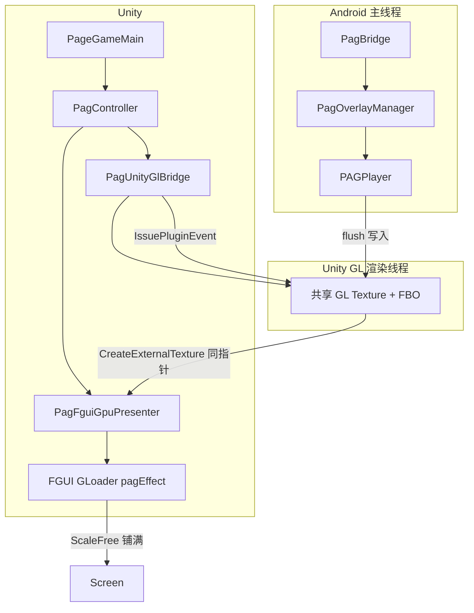
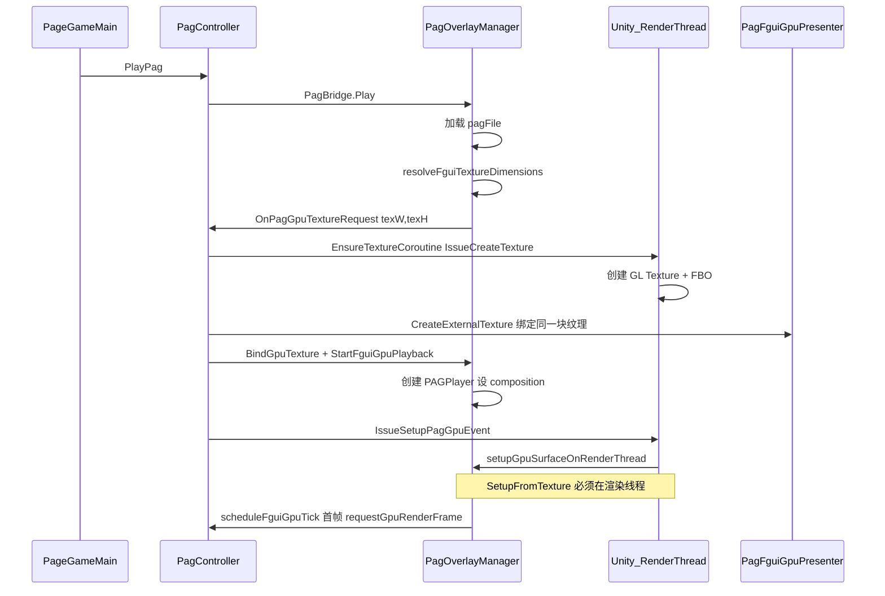
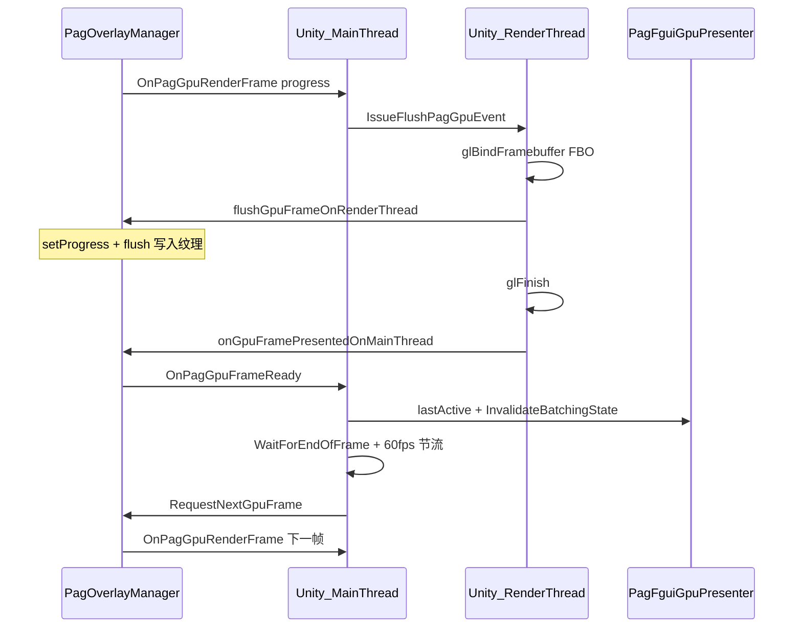

# PAG 转盘（1700）后续维护优先级清单

> 前提：单机已验收通过（能播、不闪、原画质），当前仅一款机型。  
> 关联文档：[`RETEST_PAG_UFO.md`](RETEST_PAG_UFO.md)  
> **美术向**：[`../../docs/PAG_ARTIST_GUIDE.md`](../../docs/PAG_ARTIST_GUIDE.md)（制作规范、体积预算、交付验收）  
> **2026-07：** 1700 PagTest 区复测通过（30fps 配置，单路 + 六段连播），GL 链路已冻结 → 详见 [`PAG_PERF_RETEST.md`](PAG_PERF_RETEST.md)。

## 术语（全项目统一）

| 对外称谓 | 含义 | 代码开关（不改名） |
|----------|------|-------------------|
| **纹理模式** | libpag 绘制到 Unity 共享 GL 纹理 → FGUI `pagEffect` ExternalTexture；可与 Spine 分层 | `TurnTablePagUseFguiTexture = true` / `PagRenderTarget.FguiTexture` |
| **浮层模式** | Android 系统 Overlay（PAGView / WM），与 FGUI 层级分离 | `TurnTablePagUseFguiTexture = false` / `PagRenderTarget.Overlay` |

> 不再使用「GPU 模式」「FGUI GPU 模式」作模式名（Overlay 同样走 GPU 渲染）。实现细节中的 `GpuPlayer`、`PagGpuSyncGroup`、`glFinish` 等保留原称。

---

## 当前基线（已落地）

| 项 | 配置 / 行为 |
|----|-------------|
| 显示模式 | **纹理模式**（FGUI ExternalTexture，`TurnTablePagUseFguiTexture = true`） |
| 画质 | `TurnTablePagFguiMaxDisplaySide = 0`（合成原尺寸，1:1 渲染） |
| 帧率节流 | `TurnTablePagFguiFps = 60` |
| progress | `elapsed / durationUs` 时间轴（非固定帧序号） |
| 帧同步 | 渲染线程 `flush + glFinish` → 主线程通知 → `WaitForEndOfFrame` → `RequestNextGpuFrame` |
| 播完 | 等待 `OnPagPlaybackFinished`，非固定超时 |

---

## 纹理模式渲染流程

核心思路：**Unity 在 GL 渲染线程创建 RGBA 纹理，libpag GPU 绘制到该纹理，FGUI 通过 ExternalTexture 显示同一块纹理**。不走 CPU 读像素、不走 `LoadRawTextureData`。

### 架构总览



**FGUI 显示层级**（转盘 `anchorTurnTable`）：

```
anchorTurnTable
  ├── pagEffect (GLoader)  ← 须在 FGUI 编辑器预置；层级由兄弟顺序决定
  └── holder (Graph)       ← Spine 挂载点
```

使用 `FguiTexture` 的锚点组件必须在 FGUI 包内手动添加名为 `pagEffect` 的 GLoader，发布后随 `*_fui.bytes` 进包。

### 阶段一：播放前准备（业务层）

`PageGameMain` 典型顺序：

1. `EnsureTurnTablePagSlot()` — `Attach(anchorTurnTable)`，内部 `TryGetPagEffectLoader` + `BindFguiLoader`
2. `PreparePlay(useFguiTexture, maxSide, fps)` — `SetRenderTarget` + `ConfigureFguiFrame` + `PrepareFguiLayoutBeforePlay`
3. `PlayPag("Dragon.pag" / "UFO.pag")` — 调 `PagBridge.Play`

PAG 绑定只依赖 FGUI 锚点；`CLonegoNpc` 仅用于 Spine wrapper。

### 阶段二：初始化（每个 PAG 文件一次）



| 步骤 | 线程 | 作用 |
|------|------|------|
| `resolveFguiTextureDimensions` | Android 主线程 | 计算渲染纹理宽高（`maxSide=0` 时为合成原尺寸） |
| `EnsureTextureCoroutine` | Unity 主线程 → 渲染线程 | C++ `PagUnityGlBridge` 创建 GL 纹理 |
| `CreateExternalTexture` | Unity 主线程 | FGUI 与 libpag **共享同一 GL 纹理 ID** |
| `setupGpuSurfaceOnRenderThread` | **Unity 渲染线程** | `PAGSurface.SetupFromTexture` / `FromTexture` |
| `BindExternalTexture` | Unity 主线程 | `pagEffect` 挂外部纹理；显示尺寸为合成原尺寸 + `ScaleFree` |

### 阶段三：逐帧播放（循环）



每帧分工简述：

1. **Java `requestGpuRenderFrame`** — 按时间轴算 `progress = elapsed / durationUs`（0→1），通知 Unity flush
2. **Unity 渲染线程** — `setProgress` + `flush` 写入纹理 → `glFinish` → 主线程 `notifyGpuFrameReady`
3. **Unity 主线程 `OnPagGpuFrameReady`** — FGUI 轻量刷新；`WaitForEndOfFrame` 后 `RequestNextGpuFrame`
4. **Java `onGpuFrameFlushed`** — 首帧 `OnPlayStarted`；末帧 `notifyPlaybackFinished`

### 阶段四：播完与切 clip

- **单段播完**：`progress >= 0.999` → `notifyPlaybackFinished` → 业务协程继续下一段
- **Dragon → UFO**：重新 `PlayPag` → `resolveFguiTextureDimensions` → 尺寸变化时重建纹理 + `setupGpuSurfaceOnRenderThread` → 新逐帧循环

### 三层「尺寸」说明

| 概念 | 来源 | 示例（Dragon） |
|------|------|----------------|
| **合成尺寸** | `pagFile.width/height` | 720×1281 |
| **渲染纹理尺寸** | `resolveFguiTextureDimensions` | 720×1281（`maxSide=0` 与合成一致） |
| **FGUI 显示尺寸** | `GetCompositionWidth/Height` → `pagEffect.SetSize` | 720×1281，`ScaleFree` 铺满 holder |

若 `maxSide > 0`，仅渲染纹理被缩小，显示仍按合成尺寸放大，画面会发糊。

### 线程与同步（维护时勿轻易改动）

| 操作 | 必须在哪执行 | 原因 |
|------|--------------|------|
| 创建 GL 纹理 | Unity 渲染线程 | 与 Unity/FairyGUI 同一 GL 上下文 |
| `SetupFromTexture` / `flush` | Unity 渲染线程 | 与 Unity 共享纹理，否则易 SIGSEGV |
| `UnitySendMessage` | 主线程 | 渲染线程直接发消息会时序错乱、闪屏 |
| `glFinish` | flush 后、通知 FGUI 前 | 保证采样时纹理已写完 |
| 下一帧请求 | `WaitForEndOfFrame` 之后 | 与 Unity 显示节奏对齐 |

### 与浮层模式对比

| | 纹理模式（当前） | 浮层模式 |
|--|-----------------|----------|
| 显示位置 | FGUI `pagEffect`，Spine 可盖住 | 系统浮层（PAGView / WM） |
| 数据路径 | libpag flush → Unity GL 纹理 → FGUI ExternalTexture | TextureView / ImageView |
| 适用 | 转盘嵌 UI、与 Spine 分层 | 实现简单、与 FGUI 层级分离 |

---

## P0 — 保持现状（现在就做）

| # | 项 | 动作 | 原因 |
|---|-----|------|------|
| 1 | **冻结核心链路** | 不改 GL 同步、帧调度、`PagFguiGpuPresenter` 刷新逻辑 | 已稳定，改动风险大于收益 |
| 2 | **冻结画质配置** | 保持 `TurnTablePagFguiMaxDisplaySide = 0` | 单机已验证原画质可接受 |
| 3 | **规范构建流程** | 改 JNI / `.so` 必须打完整 APK 并重装；仅 Java / Hotfix 时走 `sync_pagbridge` + Hotfix | 避免 `.so` 未打入 APK 回归 |
| 4 | **发版前验收** | 按 [`RETEST_PAG_UFO.md`](RETEST_PAG_UFO.md) 过一遍 | Dragon / UFO 各一次 `notifyPlaybackFinished` |

### P0 构建命令速查

```bat
REM 改了 PagUnityGlBridge.cpp / .so（build_android_debug 已含编译 so + sync + 打 APK）
Tools\build_android_debug.bat skipcopy nopause
adb install -r TheOutput\TargetProject\launcher\build\outputs\apk\debug\treasury_debug_machine_v1_2_0.apk

REM 仅改了 Java 或 Hotfix C#
Tools\build_android_debug.bat hotfix nopause
```

### P0 logcat 必看 tag

`PagOverlayManager`、`PagUnityGlBridge`、`PagBridgeUnity`

---

## P1 — 观察项（有问题再做）

| # | 项 | 触发条件 | 建议改动 | 涉及文件（参考） |
|---|-----|----------|----------|------------------|
| 1 | ~~**播完回调不准**~~ | ~~`WaitForPlaybackFinished timeout`~~ | **已落地**：progress 按 `durationUs` 时间轴计算 | `PagOverlayManager.java` |
| 2 | **偶发播停** | logcat 出现 `flushGpuFrameOnRenderThread failed` 或 `EGL_BAD_ACCESS` 连续刷屏 | flush 失败重试 1～2 次；超时后强制 `notifyPlaybackFinished` | `PagOverlayManager.java`、`PagUnityGlBridge.cpp` |
| 3 | **切 clip 闪一下** | Dragon → UFO 切换瞬间黑屏 / 闪一下 | 预分配最大尺寸纹理，减少切 clip 时 `DestroyTexture` 重建 | `PagUnityGlBridge.cpp`、`PagFguiGpuPresenter.cs` |
| 4 | **发热 / 掉帧** | 长时间玩转盘后 FPS 明显下降 | 评估 `glFinish` → `glFenceSync`（非首选，需真机对比） | `PagUnityGlBridge.cpp` |
| 5 | ~~**双路同屏 &lt;25 FPS**~~ | PAG1+P2 渐降、PAG1+P3≈3 FPS | **2026-07 已修**：`PagGpuSyncGroup` 部分 batch flush；同屏跳过 per-instance fps align → 见 [`PAG_PERF_RETEST.md`](PAG_PERF_RETEST.md) | `PagGpuSyncGroup.cs`、`PageGameMain.cs` |

---

## P2 — 新机台接入时（扩展机型再做）

| # | 项 | 动作 |
|---|-----|------|
| 1 | **全量复测** | 新机跑完整 [`RETEST_PAG_UFO.md`](RETEST_PAG_UFO.md)（目视 + logcat） |
| 2 | **画质分档** | 若新机掉帧或发热：按机型设 `maxDisplaySide`（0=原画 / 720 / 512） |
| 3 | **构建校验** | CI 或脚本校验 APK 内 `libpag_unity_gl_bridge.so` 大小与关键符号 |

### P2 画质分档参考（仅多机型时启用）

| 档位 | `maxDisplaySide` | 适用 |
|------|------------------|------|
| 原画 | `0` | 当前单机 / 高端机 |
| 高清 | `720` | 中端机，长边限制 720 |
| 流畅 | `512` | 低端机，长边限制 512 |

配置入口：`PageGameMain.TurnTablePagFguiMaxDisplaySide` → `PagController.ConfigureFguiFrame(maxSide, fps)`。

---

## P3 — 工程化（有余力再做）

| # | 项 | 说明 | 涉及文件（参考） |
|---|-----|------|------------------|
| 1 | 生命周期清理 | `PagController.OnDestroy` 停协程 + `Clear()`，防切场景多打 JNI | `PagController.cs` |
| 2 | 初始占位尺寸 | holder 未就绪时避免 100×100 占位跳变；布局就绪后再播 / 再 `RefreshDisplayLayout`；FguiTexture 锚点须预置 `pagEffect` | `PagFguiGpuPresenter.cs`、`PageGameMain.cs`、`AnchorTurnTable.xml` |
| 3 | Editor 预览 | Overlay 回退或 mock，方便非真机调试 | `PagController.cs` |
| 4 | 配置外置 | `maxSide` / `fps` 收到机型配置，多游戏复用 | `PageGameMain.cs` |

---

## 建议执行顺序

```
现在       → 只做 P0，其余不动
出问题时   → 按 P1「触发条件」对症处理，改完用 RETEST 复测
加新机台   → 先做 P2-1 全量复测，再决定要不要 P2-2 分档
日常迭代   → P3 随版本节奏慢慢补
```

---

## 一句话原则

**单机已稳：不主动优化；有 log / 有现象再动；加机型再分级。**

---

## 关键文件索引

| 层级 | 路径 |
|------|------|
| 业务 | `Assets/HotFix/Games/Slot Zhu Zai Jin Bi 1700/PageGameMain.cs` |
| Unity 控制 | `Assets/HotFix/Games/_Common/Anim UI/PagController.cs` |
| FGUI 显示 | `Assets/HotFix/Games/_Common/Anim UI/PagFguiGpuPresenter.cs` |
| Native 播放 | `Assets/Plugins/Android/pagBridge.androidlib/.../PagOverlayManager.java` |
| JNI 桥 | `Assets/Plugins/Android/pagBridge.androidlib/.../PagBridge.java` |
| GL 纹理 | `Assets/Plugins/Android/pagBridge.androidlib/.../PagUnityGlBridge.cpp` |
| 构建脚本 | `Tools/AndroidBuild/`（入口 `Tools/build_android_debug.bat`） |
| 验收清单 | `Tools/AndroidBuild/docs/RETEST_PAG_UFO.md` |
| 性能复测（PagTest 30fps） | `Tools/AndroidBuild/docs/PAG_PERF_RETEST.md` |
